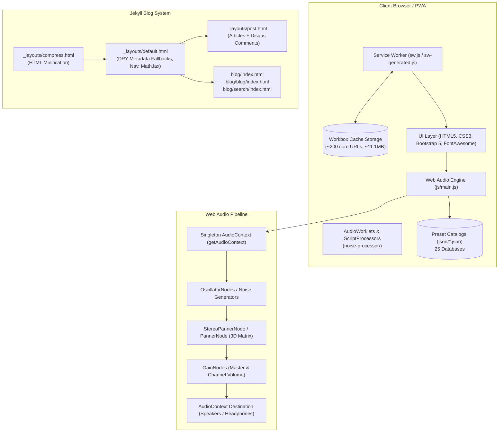

# Developer Guide & Architecture Reference

Welcome to the developer documentation for **Brain Beats**. This guide provides an in-depth reference for understanding the architecture, setting up the local development environment, testing with the TDD suite, building the PWA and Jekyll blog, and contributing to the codebase.

---

## 1. System Architecture Overview

Brain Beats is an offline-first, client-side Progressive Web Application (PWA) designed for brainwave entrainment, sound therapy, and acoustic research. It pairs a high-performance Web Audio synthesis engine with an extensive research blog powered by Jekyll.



### Core Architecture Pillars:
1. **Zero-Backend Audio Synthesis:** All frequency generation, binaural beat processing, monaural modulation, and noise shaping runs entirely client-side inside the browser using the **Web Audio API**. It functions 100% offline without needing an active internet connection.
2. **Offline-First PWA:** Service Worker precaches all core assets, application scripts, styles, audio processors, and 25 JSON preset databases.
3. **DRY Jekyll Architecture:** Clean Liquid layout inheritance with automatic fallback chains for SEO/meta tags across thousands of research articles.
4. **Automated TDD Test Suite:** Node.js-based test suite (`npm test`) validating syntax, audio lifecycle, DSP functions, JSON database integrity, and precache completeness.

---

## 2. Prerequisites & Tooling

| Requirement | Recommended Version | Purpose |
| :--- | :--- | :--- |
| **Node.js & npm** | Node v18+ / npm v9+ | Running the TDD test suite, Workbox CLI, and build tools |
| **Ruby & Bundler** | Ruby v3.0+ / Bundler v2.3+ | Building and serving the Jekyll blog engine |
| **Git** | v2.30+ | Source control and multi-remote branch synchronization |

---

## 3. Local Development Setup

### 3.1. Clone and Install Dependencies
```bash
# Clone the repository
git clone https://github.com/Mr-Kumar-Abhishek/brain-beats.git
cd brain-beats

# Install Node dependencies
npm install

# Install Ruby gems for Jekyll
bundle install
```

### 3.2. Running the Development Server
Because Brain Beats combines the main web application with the Jekyll blog engine, run the unified Jekyll development server:
```bash
npm run serve:jekyll
# or: bundle exec jekyll serve
```
- Main Application: `http://localhost:4000/`
- Blog Home: `http://localhost:4000/blog/`
- Blog Post Listing: `http://localhost:4000/blog/blog/`
- Instant Search: `http://localhost:4000/blog/search/`

---

## 4. Web Audio Engine (`js/main.js`)

### 4.1. Singleton AudioContext Lifecycle
Modern browsers restrict autoplaying audio until a user gesture occurs. The audio engine manages state gracefully via a singleton accessor:

```javascript
// Access the shared AudioContext, creating it if necessary
function getAudioContext() {
    if (!audioCtx) {
        const AudioContextClass = window.AudioContext || window.webkitAudioContext;
        if (AudioContextClass) {
            audioCtx = new AudioContextClass();
        }
    }
    if (audioCtx && audioCtx.state === 'suspended') {
        audioCtx.resume();
    }
    return audioCtx;
}
```
All user interaction triggers (`click`, `touchstart`, `keydown`) automatically invoke `getAudioContext()` to ensure seamless audio playback without browser autoplay warnings.

### 4.2. Sound Generation Modes
* **Pure Tones (`play_pure_tone(freq)`):** Single sine-wave oscillator synthesized at target frequency.
* **Solfeggio & Angel Tones (`play_solfeggio(freq)`, `play_angel(freq)`):** Sacred geometry and resonant frequency synthesis with smooth attack/decay envelope.
* **Binaural Beats (`play_binaural(leftFreq, rightFreq)`):** Two independent sine oscillators panned hard left (`pan: -1`) and hard right (`pan: +1`), producing phase-shift entrainment in the brain's superior olivary complex.
* **Monaural Beats (`play_monaural(carrier, beat)`):** Two distinct frequencies summed into a single acoustic channel before output, creating physical amplitude modulation.
* **3D Spatial Audio (`play_sine_3d_auto`, `play_XTRA_3d_auto`):** Multi-point coordinate matrix utilizing `PannerNode` / `StereoPannerNode` with periodic spatial oscillation around the listener.
* **13 Calibrated Noise Synthesizers:**
  - White, Pink, Brown, Green, Blue, Violet, Grey, Velvet, Black, Red, Yellow, Orange, and Custom noise profiles.
  - Multi-tier fallback: AudioWorklet (`noise-processor/`) -> ScriptProcessorNode -> Generated AudioBuffer.

### 4.3. Octave Range Shifting (`adjustFrequency`)
Prevents hardware clipping or silence by shifting frequencies outside human hearing range (20 Hz - 20,000 Hz) by octaves ($2^n$):
```javascript
function adjustFrequency(freq) {
    if (freq <= 0) return 440;
    while (freq < 20) freq *= 2;
    while (freq > 20000) freq /= 2;
    return freq;
}
```

---

## 5. Preset Database Architecture (`json/`)

Brain Beats includes 25 structured JSON preset collections:

| Collection | Path | Description |
| :--- | :--- | :--- |
| **Solfeggio** | `json/solfeggio.json` | Traditional 9-tone Solfeggio frequencies (174Hz - 963Hz) |
| **Binaural** | `json/binaural.json` | Delta, Theta, Alpha, Beta, Gamma brainwave states |
| **Isochronic** | `json/isochronic.json` | Isochronic pulsed amplitude rhythm presets |
| **Chakras** | `json/chakras.json` | 7 physical & higher spiritual chakra resonances |
| **Planetary** | `json/planetary.json` | Hans Cousto Cosmic Octave planetary calculations |
| **Rife** | `json/rife.json` | Royal Rife research frequencies |
| **VEGA** | `json/vega.json` | VEGA bioresonance frequency matrix |
| **XTRA** | `json/xtra.json` | Extra / Experimental laboratory frequencies |
| **PROV** | `json/prov.json` | Provocative / Proving experimental frequencies |
| **CUST** | `json/cust.json` | Custom blended frequency sets |
| **Angel** | `json/angel.json` | Numerological & angel harmonic frequencies |
| **Nogier** | `json/nogier.json` | Dr. Paul Nogier auriculo-medicine frequencies |
| **Brain** | `json/brain.json` | Neural oscillation targeting presets |

All presets are dynamically indexed by `js/search.js` and cached by the Service Worker for offline instant search.

---

## 6. Blog System & DRY Layout Hierarchy

The Jekyll blog system follows the **DRY (Don't Repeat Yourself)** layout design pattern:

```
_layouts/compress.html
  └── _layouts/default.html
        ├── _layouts/post.html
        ├── blog/index.html
        ├── blog/blog/index.html
        └── blog/search/index.html
```

### 6.1. Metadata Fallback Chains (`_layouts/default.html`)
Posts and pages only need to define unique frontmatter properties (`title`, `description`, `keywords`). Meta tags automatically fall back to parent or site values:
```html
<title>{{ page.title | default: site.name }}</title>
<meta name="keywords" content="{{ page.keywords | default: 'pure tones, solfeggio frequency, brainwave entrainment, binaural beats, isochronic tones' }}" >
<meta name="description" content="{{ page.description | default: site.description | default: page.title }}">
<meta name='subject' content="{{ page.subject | default: page.title | default: site.name }}">
<meta name="apple-mobile-web-app-title" content="{{ page.apple-title | default: page.title | default: site.name }}">
<meta name='application-name' content="{{ page.app-name | default: site.name }}">
<meta name="twitter:title" content="{{ page.tweet-title | default: page.title | default: site.name }}" >
<meta name="twitter:description" content="{{ page.tweet-description | default: page.description | default: site.description }}" >
<meta property="og:title" content="{{ page.og-title | default: page.title | default: site.name }}" >
```

### 6.2. Generating Posts from Presets
To regenerate or batch-generate markdown posts from JSON catalogs:
```bash
python3 generate_posts.py
```

---

## 7. Service Worker & PWA Offline Pipeline

### 7.1. Workbox Configuration (`workbox-config.js`)
Service Worker generation uses `injectManifest` with precise glob patterns:
* **Precached:** HTML, CSS, JavaScript, Web Audio processors, web fonts, icons, manifest, and all 25 `json/*.json` database files (~200 files, ~11.1MB).
* **Ignored from precache:** Dynamic markdown posts (`_posts/**/*`, `blog/**/*`), Jekyll cache (`.jekyll-cache/**/*`), site builds (`_site/**/*`), and development scratch directories.

### 7.2. Regenerating the Service Worker
Whenever you update static assets or audio processors, recompile the Service Worker manifest:
```bash
npm run build:sw
# or: npx workbox-cli injectManifest workbox-config.js
```

---

## 8. Automated Testing & TDD Suite

Brain Beats utilizes a custom Test-Driven Development (TDD) automated test harness in [`tests/audio-engine.test.js`](file:///var/www/html/tests/audio-engine.test.js).

### 8.1. Running Tests
```bash
npm test
```

### 8.2. Test Suite Phases:
1. **Phase 1: Code Parsing & Evaluation** - Syntax checks and mock Web Audio environment evaluation.
2. **Phase 2: Autoplay & AudioContext Lifecycle** - Singleton instancing, state transitions (`suspended` -> `running`).
3. **Phase 3: Single Tone Synthesis & Parameter Safety** - Pure tone, Solfeggio, and Angel tone verification.
4. **Phase 4: Double Tone Synthesis** - Binaural & Monaural beat stereo separation and teardown.
5. **Phase 5: 3D Spatial Audio & Multi-Frequency Matrices** - PannerNode and 3-point matrix coordination.
6. **Phase 6: Noise Synthesizers** - White, Pink, Brown, Green, Blue noise pipeline validation.
7. **Phase 7: Frequency Calculation & Octave Shifting** - Boundary conditions (infrasound <20Hz, ultrasound >20kHz).
8. **Phase 8: Preset Database Schema & File Integrity** - Parsing and validating all 25 JSON catalogs.
9. **Phase 9: Service Worker Offline Precache Verification** - Verifying that every URL precached in the service worker physically exists on disk.

For complete test logs and historical metrics, see [`TEST_REPORT.md`](file:///var/www/html/TEST_REPORT.md).

---

## 9. Code Style & Security Guidelines

* **XSS Prevention:** Never use `innerHTML` when interpolating user input or JSON attributes. Use `textContent` or `DOMParser` for safe rendering.
* **Safe External Links:** Always ensure external hyperlinks specify `rel="noopener noreferrer"`.
* **Resource Cleanup:** Ensure all Web Audio oscillators, panners, and gain nodes call `.stop()` and `.disconnect()` upon termination to prevent audio buffer leaks.

---

## 10. Netlify & Cloud Deployment (`netlify.toml`)

The application is configured for automated Continuous Deployment via Netlify (backed by AWS infrastructure):

* **Build Command:** `bundle exec jekyll build && npm test && npm run build:sw`
* **Publish Directory:** `_site`
* **Runtime Versions:** Controlled via `.ruby-version` (Ruby 3.3.8) and `.node-version` (Node 20).
* **Caching & Header Policies:**
  - `sw.js` and `sw-generated.js` are served with `Cache-Control: no-cache, no-store, must-revalidate` to ensure instant client updates.
  - Audio worklets, static icons, and fonts use immutable caching (`max-age=31536000, immutable`).
  - Strict security headers (`X-Frame-Options`, `X-Content-Type-Options`, `Referrer-Policy`, `Permissions-Policy`) applied globally.
  - Domain canonicalization rules map `https://brain-beats.netlify.app/*` $\to$ `https://brain-beats.in/:splat`.

---

## 11. GitHub Pages Automated CI/CD Workflow (`.github/workflows/pages.yml`)

The project includes an automated GitHub Pages deployment workflow using official GitHub Actions (`actions/deploy-pages@v4`):

* **Trigger:** Push to `master`, `main`, or `doctor/master`, and manual dispatch (`workflow_dispatch`).
* **Dual Deployment Pipeline:**
  1. Sets up Node.js 20 and Ruby 3.3.
  2. Runs `npm test` (TDD verification of the Web Audio engine and JSON presets).
  3. Precompiles Workbox service worker precache (`npm run build:sw`).
  4. Builds Jekyll production site into `_site` via Bundler.
  5. Bypasses Jekyll backend reprocessing (`.nojekyll`) and publishes artifact directly to GitHub Pages (`actions/deploy-pages@v4`).
  6. Automatically syncs and pushes compiled production assets to the `gh-pages` branch (`peaceiris/actions-gh-pages@v4`).
* **Custom Domain:** Configured via root [`CNAME`](file:///var/www/html/CNAME) (`brain-beats.in`).

---

## 12. Multi-Remote Synchronization Workflow

This project maintains synchronized branches across both `origin` (personal) and `upstream` (organization) remotes:

```bash
# Push current HEAD commit to all tracked remote branches:
for branch in $(git branch -r | grep 'origin/' | grep -v 'HEAD' | sed 's/ *origin\///'); do
  git push origin HEAD:refs/heads/$branch
done

for branch in $(git branch -r | grep 'upstream/' | grep -v 'HEAD' | sed 's/ *upstream\///'); do
  git push upstream HEAD:refs/heads/$branch
done
```

