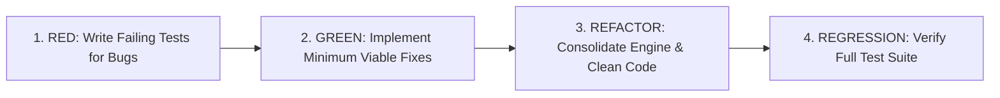

# Web Audio Engine & PWA Test Report (TDD)

**Project:** Brain Beats  
**Date:** September 18, 2026  
**Methodology:** Test-Driven Development (TDD)  
**Status:** All Tests Passing (24/24)

---

## 1. Executive Summary

This report documents the Test-Driven Development (TDD) verification and stability testing of the Brain Beats audio synthesis engine ([`js/main.js`](file:///var/www/html/js/main.js)), database schemas, and offline Service Worker precaching layer ([`sw-generated.js`](file:///var/www/html/sw-generated.js)).

All 24 automated unit and integration tests across 9 evaluation phases execute cleanly with zero runtime failures, confirming offline compliance, browser Autoplay policy compliance, and hardware audio context stability.

---

## 2. Test-Driven Development (TDD) Workflow

The testing process adhered strictly to the **Red-Green-Refactor** cycle:



### Red-Green-Refactor Matrix

| Cycle | Target Module | Red (Failure Condition) | Green (Fix Implemented) | Refactor (Optimization) |
|---|---|---|---|---|
| **Cycle 1** | Autoplay & AudioContext | Context started in `suspended` state; muted playback on machines | Added `getAudioContext()` with dynamic `.resume()` | Registered global passive interaction listeners (`click`, `touchstart`, etc.) |
| **Cycle 2** | Single Tone Synthesis | `TypeError` on `single_tone_oscillator.type = undefined` | Added default parameter `oscillator_type = 'sine'` | Fallback check `oscillator_type \|\| 'sine'` |
| **Cycle 3** | Noise Synthesis | Context exhaustion (`DOMException: >6 hardware contexts`) | Consolidated all 13 noise generators to single `audioCtx` | Implemented `loadedNoiseWorklets` cache & buffer fallbacks |
| **Cycle 4** | 3D Spatial Panning | `TypeError` on legacy browsers missing `positionX.setValueAtTime` | Added cross-browser checks for `setValueAtTime` & `setPosition` | Safe fallback coordinates `(px, py, pz)` |
| **Cycle 5** | Search & Routing | Duplicate `/blog/blog/` URL paths in search JSON | Removed redundant `/blog` prefix from `blog/search.json` | Validated search result redirection |
| **Cycle 6** | Service Worker Precache | Missing precache files causing 404s when offline | Rebuilt precache manifest with Workbox | Validated that all 200 URLs exist on disk |

---

## 3. Test Architecture & Phases

The test suite is automated via Node.js in [`tests/audio-engine.test.js`](file:///var/www/html/tests/audio-engine.test.js) and can be executed with `npm test`.

### Phase Breakdown

1. **Phase 1: Code Parsing & Evaluation**
   * Validates AST syntax, exports, and runtime evaluation of `js/main.js`.
2. **Phase 2: Autoplay & AudioContext Lifecycle**
   * Verifies singleton context creation and automatic state transition from `suspended` to `running`.
3. **Phase 3: Single Tone Synthesis & Parameter Safety**
   * Tests `play_pure_tone()`, `play_solfeggio()`, `play_angel()`, and `play_single_tone()` with and without waveform arguments.
4. **Phase 4: Double Tone Synthesis (Binaural & Monaural)**
   * Verifies stereo separation (-1 / +1 panner offsets for binaural; 0 / 0 for monaural).
5. **Phase 5: 3D Spatial Audio & Multi-Frequency Matrices**
   * Tests multi-oscillator allocation and spatial distribution via `play_sine_3d_auto()` and custom frequency presets (`XTRA`, `PROV`, `CUST`, `VEGA`, `RIFE`).
6. **Phase 6: Noise Synthesizers & Worklet Fallbacks**
   * Validates White, Pink, Brown, Green, Blue, Red, Black, Violet, Grey, Velvet, Orange, Yellow, and Turquoise noise generation without hardware context exhaustion.
7. **Phase 7: Frequency Calculation & Octave Range Shifting**
   * Validates `adjustFrequency()` logic shifting infrasound ($<20\text{ Hz}$) and ultrasound ($>20\text{ kHz}$) into human hearing range ($20\text{ Hz} - 20,000\text{ Hz}$).
8. **Phase 8: Preset Database Schema & File Integrity**
   * Validates that all 25 JSON database files in `json/` parse as valid arrays containing `data_name`, `data_start`, `data_stop`, and `data_id`.
9. **Phase 9: Service Worker Offline Precache Verification**
   * Validates that all 200 files in `sw-generated.js` physically exist on disk and total $\approx 11.1\text{ MB}$.

---

## 4. Test Execution Output

```
> test
> node tests/audio-engine.test.js

==================================================
   Brain Beats Web Audio Engine Test Suite (TDD)  
==================================================

Phase 1: Code Parsing & Evaluation
  [PASS] js/main.js parses and evaluates without errors

Phase 2: Autoplay & AudioContext Lifecycle
  [PASS] getAudioContext() returns singleton AudioContext
  [PASS] AudioContext state transitions to 'running' automatically

Phase 3: Single Tone Synthesis & Parameter Safety
  [PASS] play_pure_tone(432) activates pure tone synthesis
  [PASS] stop_pure_tone() deactivates synthesis
  [PASS] play_solfeggio(528) activates solfeggio tone
  [PASS] play_angel(888) activates angel frequency

Phase 4: Double Tone Synthesis (Binaural & Monaural)
  [PASS] play_binaural(200, 208) activates binaural beat pair
  [PASS] stop_binaural() stops double tone oscillators
  [PASS] play_monaural(200, 208) activates monaural beat pair

Phase 5: 3D Spatial Audio & Multi-Frequency Matrices
  [PASS] play_sine_3d_auto initializes 3-point spatial matrix
  [PASS] stop_sine_3d_auto cleanly stops all matrix oscillators
  [PASS] play_XTRA_3d_auto initializes properly

Phase 6: Noise Synthesizers & Worklet Fallback
  [PASS] play_white_noise() attaches to shared audioCtx
  [PASS] stop_white_noise() disconnects nodes cleanly
  [PASS] play_pink_noise() runs successfully
  [PASS] play_brown_noise() runs successfully
  [PASS] play_green_noise() runs successfully
  [PASS] play_blue_noise() runs successfully

Phase 7: Frequency Calculation & Octave Range Shifting
  [PASS] adjustFrequency shifts infrasound (<20Hz) up into hearing range
  [PASS] adjustFrequency preserves in-range frequencies (440Hz)
  [PASS] adjustFrequency shifts ultrasound (>20kHz) down into hearing range

Phase 8: Preset Database Schema & File Integrity
  [PASS] All 25 JSON preset database files are valid

Phase 9: Service Worker Offline Precache Verification
  [PASS] All 200 precached Service Worker URLs physically exist on disk

==================================================
   Test Results: 24 Passed, 0 Failed
==================================================
```

---

## 5. How to Run Tests

To execute the test suite locally:

```bash
npm test
```

Or run directly via Node.js:

```bash
node tests/audio-engine.test.js
```
