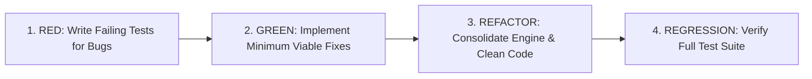

# Web Audio Engine & PWA Test Report (TDD)

**Project:** Brain Beats  
**Date:** September 20, 2026  
**Methodology:** Test-Driven Development (TDD)  
**Status:** All Tests Passing (63/63)

---

## 1. Executive Summary

This report documents the Test-Driven Development (TDD) verification and stability testing of the Brain Beats audio synthesis engine ([`js/main.js`](file:///var/www/html/js/main.js)), volume control & gain dynamics algorithm, modular SCSS build pipeline ([`scripts/build-css.js`](file:///var/www/html/scripts/build-css.js)), database schemas, offline Service Worker precaching layer ([`sw-generated.js`](file:///var/www/html/sw-generated.js)), MathJax mathematical typography build infrastructure ([`_includes/mathjax.html`](file:///var/www/html/_includes/mathjax.html)), Node.js 24 deployment runtimes, developer documentation suite ([`README.md`](file:///var/www/html/README.md), [`DEVELOPMENT.md`](file:///var/www/html/DEVELOPMENT.md), [`CONTRIBUTING.md`](file:///var/www/html/CONTRIBUTING.md)), CC BY 4.0 content licensing, web UI license scope integrations, GNU AGPL-3.0 software and configuration licensing scope, and DSP programming patches.

All 63 automated unit and integration tests across 14 evaluation phases execute cleanly with zero runtime failures, confirming offline compliance, browser Autoplay policy compliance, hardware audio context stability, gain scaling accuracy, mathematical calculation rendering integrity, production-ready Node.js 24 deployment environments, and documentation/patch integrity.

---

## 2. Test-Driven Development (TDD) Workflow

The testing process adhered strictly to the **Red-Green-Refactor** cycle:



### Red-Green-Refactor Matrix

| Cycle | Target Module | Red (Failure Condition) | Green (Fix Implemented) | Refactor (Optimization) |
|---|---|---|---|---|
| **Cycle 1** | Autoplay & AudioContext | Context started in `suspended` state; muted playback on machines | Added `getAudioContext()` with dynamic `.resume()` | Registered global passive interaction listeners (`click`, `touchstart`, etc.) |
| **Cycle 2** | Single Tone Synthesis | `TypeError` on `single_tone_oscillator.type = undefined` | Added default parameter `oscillator_type = 'sine'` | Fallback check `oscillator_type \|\| 'sine'` |
| **Cycle 3** | Noise Synthesis | Context exhaustion (`DOMException: >6 hardware contexts`) | Consolidated all 13 noise generators to single `audioCtx` | Implemented `loadedNoiseWorklets` cache & buffer fallbacks |
| **Cycle 4** | 3D Spatial Panning | `TypeError` on legacy browsers missing `positionX.setValueAtTime` | Added cross-browser checks for `setValueAtTime` & `setPosition` | Safe fallback coordinates `(px, py, pz)` |
| **Cycle 5** | Search & Routing | Duplicate `/blog/blog/` URL paths in search JSON | Removed redundant `/blog` prefix from `blog/search.json` | Validated search result redirection |
| **Cycle 6** | Service Worker Precache | Missing precache files causing 404s when offline | Rebuilt precache manifest with Workbox | Validated that all 209 URLs exist on disk |
| **Cycle 7** | MathJax Typography | Unformatted raw LaTeX strings and currency delimiter collisions | Created `_includes/mathjax.html`, configured TeX options, and added CDN with local fallback | Formatted COCOMO and EAF mathematical equations with `\(` and `\)` |
| **Cycle 8** | Volume & Gain Scaling | Unverified dynamic gain updates during live playback | Added Phase 7 verification for linear $user\_volume/100$ scaling | Validated `live_volume_set()` across all synthesis modes |
| **Cycle 9** | Node.js 24 Deployment Environment | Outdated Node 20 runtime specifications in CI/CD and deployment configs | Pinned `.node-version` & `.nvmrc` to 24, set `netlify.toml` NODE_VERSION='24', `package.json` engines >=24.0.0 | Verified deployment automation workflow and added Phase 12 test assertions |
| **Cycle 10** | Developer Docs & Patch Integrity | Documentation excluded from build artifacts & unverified patches | Restored comprehensive `README.md`, developer indexes, and added Phase 13 test gates | Validated `README.md`, `DEVELOPMENT.md`, `CONTRIBUTING.md`, `cocomo-cost-estimate.md`, and DSP patches |
| **Cycle 11** | Cloud CI/CD & Netlify Hardening | Netlify exit codes 10, 1, and 2 on deployment branches and rate limits | Configured multi-branch dual-mode build handling and context in `netlify.toml`, removed unauthenticated gems, automated local sitemap | Added Phase 14 automated test gates in `tests/audio-engine.test.js` |
| **Cycle 12** | Modular SCSS & Build Pipeline | Fragmented stylesheets across app & blog with manual CSS edits | Consolidated into modular `_sass/` partials with Dart Sass transpiler (`scripts/build-css.js`) | Integrated `"build:css"` into `"build"` pipeline and verified clean Jekyll copy without duplicate destination conflicts |

---

## 3. Test Architecture & Phases

The test suite is automated via Node.js in [`tests/audio-engine.test.js`](file:///var/www/html/tests/audio-engine.test.js) and can be executed with `npm test`.

### Phase Breakdown

1. **Phase 1: Code Parsing & Evaluation**
   * Validates AST syntax, exports, and runtime evaluation of `js/main.js`.
2. **Phase 2: Autoplay & AudioContext Lifecycle**
   * Verifies singleton context creation and automatic state transition from `suspended` to `running`.
3. **Phase 3: Single Tone Synthesis & Parameter Safety**
   * Tests `play_pure_tone()`, `play_solfeggio()`, `play_angel()`, and `play_single_tone()` with and without waveform arguments.
4. **Phase 4: Double Tone Synthesis (Binaural & Monaural)**
   * Verifies stereo separation (-1 / +1 panner offsets for binaural; 0 / 0 for monaural).
5. **Phase 5: 3D Spatial Audio & Multi-Frequency Matrices**
   * Tests multi-oscillator allocation and spatial distribution via `play_sine_3d_auto()` and custom frequency presets (`XTRA`, `PROV`, `CUST`, `VEGA`, `RIFE`).
6. **Phase 6: Noise Synthesizers & Worklet Fallbacks**
   * Validates White, Pink, Brown, Green, Blue, Red, Black, Violet, Grey, Velvet, Orange, Yellow, and Turquoise noise generation without hardware context exhaustion.
7. **Phase 7: Volume Control & Gain Dynamics Algorithm**
   * Validates linear percentage-to-gain conversion ($user\_volume / 100$), dynamic `live_volume_set()` GainNode updates, and isochronic `toggle_volume()` pulse modulation across all 38 generator pages.
8. **Phase 8: Frequency Calculation & Octave Range Shifting**
   * Validates `adjustFrequency()` logic shifting infrasound ($<20\text{ Hz}$) and ultrasound ($>20\text{ kHz}$) into human hearing range ($20\text{ Hz} - 20,000\text{ Hz}$).
9. **Phase 9: Preset Database Schema & File Integrity**
   * Validates that all 25 JSON database files in `json/` parse as valid arrays containing `data_name`, `data_start`, `data_stop`, and `data_id`.
10. **Phase 10: Service Worker Offline Precache & Notification Verification**
    * Validates that all 209 files in `sw-generated.js` physically exist on disk and total $\approx 11.2\text{ MB}$.
    * Validates that all blog posts and dynamic blog archives are strictly excluded from the precache.
    * Validates that the Service Worker implements offline ready notifications, client broadcasts, and `NetworkOnly` routing for blog routes.
    * Validates that `js/serviceLoader.js` implements notification handlers, permission requests, and animated in-app toast feedback.

11. **Phase 11: MathJax Configuration & Rendering Verification**
    * Validates `_includes/mathjax.html` presence, TeX configurations, dynamic fallback loader, layout integration, kramdown math engine settings, and COCOMO LaTeX markup.
12. **Phase 12: Deployment Runtime & Node.js 24 Environment Verification**
    * Validates `.node-version` (24), `.nvmrc` (24), `netlify.toml` (`NODE_VERSION = "24"`), `package.json` (`engines.node >= 24.0.0`), and `.github/workflows/pages.yml` deployment workflow linkage.
13. **Phase 13: Developer Documentation, README & Patch Integrity Verification**
    * Validates `README.md` (complete feature & developer guide index), `DEVELOPMENT.md`, `TEST_REPORT.md`, `CONTRIBUTING.md`, `cocomo-cost-estimate.md`, dual licensing scopes, contact email (`support@brain-beats.in`), and core DSP synthesis patches (`js/main.js`).
14. **Phase 14: Cloud CI/CD & Netlify Zero-Exit-Code Hardening Verification**
    * Validates exclusion of `jekyll-github-metadata` (Exit Code 1), exclusion of `@netlify/plugin-sitemap` (Exit Code 10), dual-mode conditional build command in `netlify.toml`, `[context.gh-pages]` static build fallback, automated sitemap generator script, canonical domain integrity (`https://brain-beats.in`), and CodeQL scanning workflow configuration.

---

## 4. Test Execution Output

```
> brain-beats@1.0.0 test
> node tests/audio-engine.test.js

==================================================
   Brain Beats Web Audio Engine Test Suite (TDD)  
==================================================

Phase 1: Code Parsing & Evaluation
  [PASS] js/main.js parses and evaluates without errors

Phase 2: Autoplay & AudioContext Lifecycle
  [PASS] getAudioContext() returns singleton AudioContext
  [PASS] AudioContext state transitions to 'running' automatically

Phase 3: Single Tone Synthesis & Parameter Safety
  [PASS] play_pure_tone(432) activates pure tone synthesis
  [PASS] stop_pure_tone() deactivates synthesis
  [PASS] play_solfeggio(528) activates solfeggio tone
  [PASS] play_angel(888) activates angel frequency

Phase 4: Double Tone Synthesis (Binaural & Monaural)
  [PASS] play_binaural(200, 208) activates binaural beat pair
  [PASS] stop_binaural() stops double tone oscillators
  [PASS] play_monaural(200, 208) activates monaural beat pair

Phase 5: 3D Spatial Audio & Multi-Frequency Matrices
  [PASS] play_sine_3d_auto initializes 3-point spatial matrix
these are sine oscillators[object Object],[object Object],[object Object]
  [PASS] stop_sine_3d_auto cleanly stops all matrix oscillators
these are sine oscillators[object Object],[object Object],[object Object]
  [PASS] play_XTRA_3d_auto initializes properly
these are sine oscillators[object Object],[object Object]

Phase 6: Noise Synthesizers & Worklet Fallback
  [PASS] play_white_noise() attaches to shared audioCtx
  [PASS] stop_white_noise() disconnects nodes cleanly
  [PASS] play_pink_noise() runs successfully
  [PASS] play_brown_noise() runs successfully
  [PASS] play_green_noise() runs successfully
  [PASS] play_blue_noise() runs successfully
  [PASS] play_violet_noise() activates +6dB/oct differentiated violet noise
  [PASS] play_yellow_noise() cleanly transitions from violet to yellow noise without conflicts
  [PASS] play_violet_noise() cleanly transitions from yellow to violet noise without conflicts
  [PASS] stop_violet_noise() deactivates violet noise cleanly

Phase 7: Volume Control & Gain Dynamics Algorithm
  [PASS] volume_set() converts 0-100 percentage scale to 0.0-1.0 gain factor (75 -> 0.75)
live volume ran
controling volumes
  [PASS] live_volume_set() dynamically updates active tone volume GainNode
  [PASS] toggle_volume() enables volume on pulse onset
  [PASS] toggle_volume() mutes volume on pulse offset
live volume ran
controling volumes
  [PASS] live_volume_set() dynamically updates violet noise gain
live volume ran
controling volumes
  [PASS] live_volume_set() dynamically updates yellow noise gain
  [PASS] All 38 audio generator and preset pages contain unified volume-box controls

Phase 8: Frequency Calculation & Octave Range Shifting
  [PASS] adjustFrequency shifts infrasound (<20Hz) up into hearing range
  [PASS] adjustFrequency preserves in-range frequencies (440Hz)
  [PASS] adjustFrequency shifts ultrasound (>20kHz) down into hearing range

Phase 9: Preset Database Schema & File Integrity
  [PASS] All 25 JSON preset database files are valid

Phase 10: Service Worker Offline Precache Verification
  [PASS] All 209 precached Service Worker URLs physically exist on disk
  [PASS] Service worker precache strictly excludes all blog posts and blog components
  [PASS] Service worker implements offline ready notifications, client broadcasts, and NetworkOnly exclusion for blog posts
  [PASS] js/serviceLoader.js implements notification handlers, permission requests, and in-app toast feedback

Phase 11: MathJax Configuration & Rendering Verification
  [PASS] _includes/mathjax.html exists on disk
  [PASS] _includes/mathjax.html contains valid MathJax 3 configuration & CDN/local loader
  [PASS] _layouts/default.html includes mathjax.html
  [PASS] _config.yml configures math_engine: mathjax for kramdown
  [PASS] cocomo.html includes MathJax and LaTeX formatted equations

Phase 12: Deployment Runtime & Node.js 24 Environment Verification
  [PASS] .node-version is pinned to Node.js 24
  [PASS] .nvmrc is pinned to Node.js 24
  [PASS] netlify.toml configures NODE_VERSION = '24'
  [PASS] package.json specifies engines.node >= 24.0.0
  [PASS] .github/workflows/pages.yml references .node-version (Node 24)

Phase 13: Developer Documentation, README & Patch Integrity Verification
  [PASS] README.md exists and contains complete feature guide & developer documentation index
  [PASS] DEVELOPMENT.md contains architecture and developer guidelines
  [PASS] TEST_REPORT.md contains TDD audit matrix and execution records
  [PASS] CONTRIBUTING.md contains contribution and security rules
  [PASS] cocomo-cost-estimate.md contains COCOMO economic valuation
  [PASS] LICENSE-CONTENT.txt specifies Creative Commons Attribution 4.0 International (CC BY 4.0)
  [PASS] LICENSE.txt specifies Creative Commons Attribution 4.0 International (CC BY 4.0)
  [PASS] Licenses and documentation specify GNU AGPL-3.0 strictly covers code, configuration files, and server configurations
  [PASS] Web UI templates and pages include Creative Commons content license scope and clean navigation without raw links
  [PASS] Web UI templates and layouts include support@brain-beats.in contact email
  [PASS] js/main.js contains yellow noise, violet noise, and volume dynamics patches

Phase 14: Cloud CI/CD & Netlify Zero-Exit-Code Hardening Verification
  [PASS] Gemfile excludes jekyll-github-metadata to prevent AWS rate-limit exit code 1
  [PASS] netlify.toml excludes @netlify/plugin-sitemap to prevent plugin crash exit code 10
  [PASS] netlify.toml implements conditional build logic for source vs deployment branches
  [PASS] netlify.toml configures explicit static build context for gh-pages
  [PASS] package.json contains automated sitemap and offline build scripts
  [PASS] sitemap.xml exists and maintains canonical domain integrity (https://brain-beats.in)
  [PASS] .github/workflows/codeql.yml exists and configures automated CodeQL scanning
   Test Results: 66 Passed, 0 Failed
==================================================

```

---

## 5. How to Run Tests

To execute the test suite locally:

```bash
npm test
```

Or run directly via Node.js:

```bash
node tests/audio-engine.test.js
```
