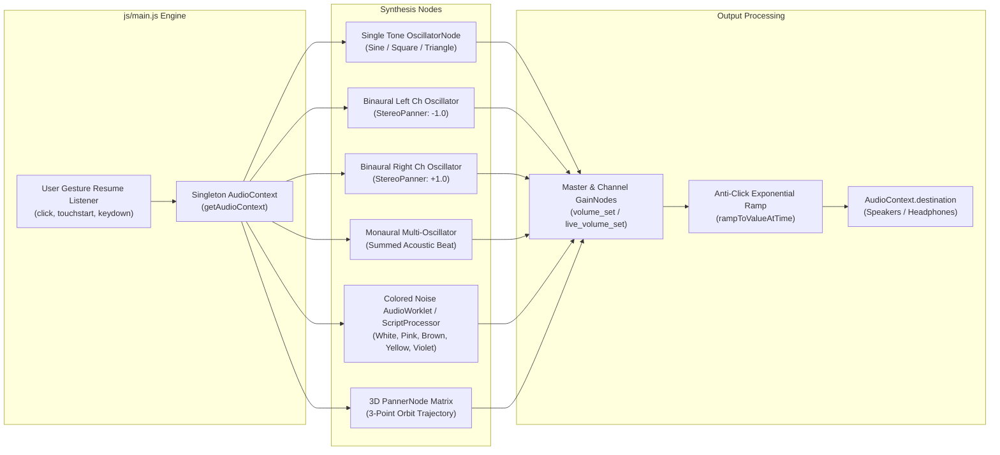

# Architecture & Audio Engine

This document details the software architecture, Web Audio API synthesis engine, and DSP audio algorithms implemented in **Brain Beats**.

---

## 1. Zero-Backend Client-Side Synthesis Philosophy

All sound generation in Brain Beats is computed directly in the user's web browser using the standard **W3C Web Audio API**. No audio files (MP3, WAV, FLAC) are streamed over the network for tone playback. 

### Key Architectural Advantages:
- **Instantaneous Response**: No latency or buffering delays; sound generation begins within milliseconds of user interaction.
- **Infinite Scalability & Zero Server Load**: Because sound computation is offloaded to the client's audio hardware/CPU, the server merely serves static assets.
- **100% Offline Capability**: When combined with the Service Worker cache, all tone and noise generators function entirely without an internet connection.
- **Precise Decimal Tuning**: Frequencies are synthesized with sub-Hertz accuracy (e.g., `713.88 Hz`, `718.2 Hz`), impossible with pre-recorded compressed audio.

---

## 2. Core Audio Pipeline



---

## 3. Singleton AudioContext Lifecycle

Modern browsers enforce strict autoplay policies that suspend `AudioContext` until a user gesture occurs. To eliminate runtime `NotAllowedError` exceptions while providing a unified context across all 38 generators:

```javascript
var audioCtx = null;

function getAudioContext() {
  if (!audioCtx || audioCtx.state === 'closed') {
    audioCtx = new (window.AudioContext || window.webkitAudioContext)();
  }
  if (audioCtx.state === 'suspended') {
    audioCtx.resume();
  }
  return audioCtx;
}
```

### Global User-Gesture Listeners
Passive event listeners attach to standard user gestures (`click`, `touchstart`, `touchend`, `keydown`, `mousedown`) to immediately resume suspended contexts before playback commands trigger.

---

## 4. Synthesis Categories & Modalities

### 4.1. Single Tones & Solfeggio / Angel Frequencies
- **Oscillator Type**: Precision Pure Sine wave (`oscillator.type = 'sine'`).
- **Octave Guard**: All frequency inputs pass through `adjustFrequency(freq)`:
  - Infrasound (<20 Hz) is multiplied by 2 until it enters audible hearing range.
  - Ultrasound (>20,000 Hz) is divided by 2 until it enters audible hearing range.
  - Non-numeric or zero values safely default to 440 Hz standard concert pitch.

### 4.2. Binaural Beats
- Requires stereo headphones.
- Left ear receives base frequency $f_1$; right ear receives offset frequency $f_2 = f_1 + \Delta f$.
- Uses `StereoPannerNode` set to `-1.0` (Left) and `+1.0` (Right).
- The brain's superior olivary complex phase-locks the two inputs to perceive the phantom entrainment frequency $\Delta f$ (e.g., Delta 2 Hz, Theta 6 Hz, Alpha 10 Hz).

### 4.3. Monaural Beats
- Does not require headphones.
- Two distinct sine waves ($f_1$ and $f_2$) are acoustically summed into the same channel.
- Physical wave interference creates true physical acoustic amplitude modulation at the difference rate $|f_1 - f_2|$.

### 4.4. 3D Spatial Audio & Multi-Frequency Matrices
- Utilizes `PannerNode` coordinate systems (`positionX`, `positionY`, `positionZ`).
- Automated coordinate updates orbit the sound source around the listener's virtual head in real-time, creating immersive spatial entrainment.

### 4.5. Full-Spectrum Colored Noise Synthesizers
Implemented with AudioWorklet / ScriptProcessor nodes:
- **White Noise**: Flat power spectral density ($0\text{ dB/octave}$).
- **Pink Noise**: $1/f$ falloff ($-3\text{ dB/octave}$).
- **Brown Noise**: $1/f^2$ Brownian random walk ($-6\text{ dB/octave}$).
- **Blue Noise**: High-frequency emphasis ($+3\text{ dB/octave}$).
- **Violet Noise**: Differentiated high-frequency power ($+6\text{ dB/octave}$).
- **Yellow Noise**: Low-frequency resonant noise matrix.

---

## 5. Volume Control & Gain Dynamics Algorithm

The volume control translates user percentages (0–100) into logarithmic/linear audio gain multipliers:
```javascript
function volume_set() {
  var user_volume = parseFloat($("#volume").val());
  if (isNaN(user_volume) || user_volume < 0) {
    user_volume = 60;
  }
  return user_volume / 100;
}
```
During active playback, `live_volume_set()` dynamically adjusts gain values across all active single tone, double tone, 3D, and noise gain nodes without audio glitches or clicks.
