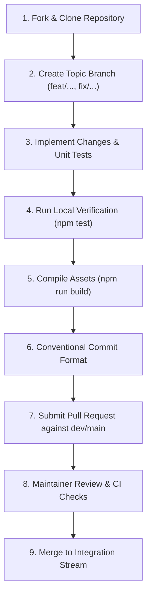

# Open Source Contribution Guidelines & Workflow

This document establishes the official contribution guidelines, open source engineering standards, and review procedures for **Brain Beats**.

---

## 1. Introduction & Philosophy

Brain Beats is an open-source, client-side psychoacoustic sound generator and frequency research platform. We welcome contributions from developers, audio engineers, researchers, and technical writers worldwide.

To maintain architectural stability, cross-browser audio compatibility, mathematical rigor, and security, all contributions must adhere to strict open-source software engineering practices, Test-Driven Development (TDD), conventional commit standards, and our dual-licensing governance model.

---

## 2. Code of Conduct

All contributors and maintainers are expected to maintain a constructive, respectful, and professional environment.

- **Respect & Professionalism:** Treat all participants with empathy, respect, and constructive critique regardless of background or level of experience.
- **Scientific & Engineering Focus:** Discussions should be grounded in evidence, psychoacoustic science, deterministic Web Audio standards, or reproducible benchmarks.
- **Zero Harassment Policy:** Unacceptable behavior, harassment, trolling, or offensive language will not be tolerated and may lead to immediate disqualification from the community.

---

## 3. How to Contribute



### 3.1 Reporting Bugs
Before filing a new bug report, search the [GitHub Issues](https://github.com/Mr-Kumar-Abhishek/brain-beats/issues) tracker to confirm that the issue has not already been reported.

When creating an issue, use the following structure:
1. **Title:** Brief, descriptive summary (e.g., `[BUG] AudioContext resume fails on Safari 17 iOS`).
2. **Environment:** Operating System, browser version, device type (desktop/mobile/tablet).
3. **Reproduction Steps:** Exact step-by-step instructions to reproduce the behavior.
4. **Expected vs. Actual Behavior:** What you expected to occur vs. what happened.
5. **Console Output / Logs:** Any JavaScript errors or warnings logged in Developer Tools.

### 3.2 Suggesting Enhancements & New Features
Feature requests and frequency research ideas should be filed as enhancement proposals:
- Clearly define the use case and psychoacoustic rationale.
- Reference peer-reviewed citations, scientific papers, or CAFL datasets if proposing new frequencies.
- Describe the architectural impact on the zero-backend client-side model.

### 3.3 Submitting Code & Pull Requests (PRs)
1. Fork the official repository: `https://github.com/Mr-Kumar-Abhishek/brain-beats`.
2. Clone your fork locally and configure the upstream remote:
   ```bash
   git clone https://github.com/<your-username>/brain-beats.git
   cd brain-beats
   git remote add upstream https://github.com/Mr-Kumar-Abhishek/brain-beats.git
   ```
3. Create a descriptive topic branch off `main` or `dev`:
   ```bash
   git checkout -b feat/solfeggio-phase-inversion
   ```
4. Follow the engineering standards outlined below.
5. Rebase against upstream before opening a PR:
   ```bash
   git fetch upstream
   git rebase upstream/main
   ```

---

## 4. Engineering & Architectural Standards

### 4.1 Strict Constraints
- **Preserve Historical Research (`/lab`):**
  The `/lab` directory contains historical research matrices and legacy scripts. **Never delete, rename, or modify files in `/lab`.**
- **Zero Heavy Frameworks:**
  Brain Beats intentionally uses native Vanilla JavaScript, Bootstrap 5, and the Web Audio API without heavy UI frameworks (React, Angular, Vue) or complex bundlers (Webpack, Vite). Keep client-side bundles lightweight and zero-dependency.
- **Static Constant Optimization ($O(1)$):**
  Avoid re-calculating invariant mathematical values inside audio synthesis loops or animation frames. Provide pre-computed lookup tables or static constants directly to prevent audio buffer underruns and garbage collection pauses.
- **Deterministic Singleton AudioContext:**
  Never instantiate new `AudioContext` instances directly in UI components. Always use `getAudioContext()` in `js/main.js` to ensure seamless mobile autoplay unlock and strict resource lifecycle management.

### 4.2 Security Rules
- **No Unsafe DOM Injection:** Never use `.innerHTML` with unsanitized user inputs or URL parameters. Use `.textContent` or `document.createElement()`.
- **Offline Precache Hygiene:** Do not add large binary media or dynamic blog posts to the service worker precache manifest (`workbox-config.js`). Only precache core UI shells and tone generators.

---

## 5. Development & Verification Workflow

### 5.1 Local Toolchains
Ensure your local environment satisfies:
- **Node.js:** `>= 24.0.0` (managed via `.node-version` or `.nvmrc`)
- **Ruby:** `>= 3.0` / Bundler `>= 2.3` (for Jekyll blog compilation)
- **npm:** `>= 10.0.0`

### 5.2 Test-Driven Development (TDD)
All synthesis routines, gain algorithms, schema changes, and UI controllers require corresponding test assertions in [`tests/audio-engine.test.js`](file:///var/www/brain-beats/tests/audio-engine.test.js).

Before committing any code, run:
```bash
npm test
```
All 69+ tests across all 14 testing phases must pass with zero failures.

### 5.3 Asset Compilation & Hygiene
If your contribution modifies styles or structural assets, build and verify:
```bash
# 1. Compile modular SCSS into css/main.css and blog/css/main.css
npm run build:css

# 2. Build complete asset bundle (CSS, sitemap, Service Worker)
npm run build

# 3. Verify Jekyll build cleanly
bundle exec jekyll build
```

---

## 6. Git & Commit Guidelines

We enforce the **Conventional Commits** specification (`<type>(<scope>): <description>`).

### 6.1 Allowed Commit Types:
- `feat`: A new user-facing feature or audio generator.
- `fix`: A bug fix or patch.
- `docs`: Documentation updates, wiki additions, or comments.
- `style`: SCSS / CSS formatting, markup spacing without logic changes.
- `refactor`: Code restructurings that neither add features nor fix bugs.
- `perf`: Performance optimizations (e.g., constant pre-computation, memory reduction).
- `test`: Adding missing tests or correcting existing tests in `tests/audio-engine.test.js`.
- `chore`: Build scripts, workflow updates, dependency bumps, or license hygiene.

### 6.2 Commit Message Examples:
```text
feat(synth): add phase adjustment slider for binaural generators
fix(audio): unlock audio context on initial pointerdown on iOS 17
docs(wiki): author contribution guidelines for open source workflow
perf(math): optimize infrasound octave shift with precomputed table
```

---

## 7. Dual-Licensing Agreement

By contributing to Brain Beats, you explicitly agree that your contributions will be distributed under the project's dual-license framework:

1. **Software, Code, Mechanics & Configuration Files:**
   All application source code, JavaScript synthesis algorithms, AudioWorklet processors, build scripts, deployment configs, and server configurations (`package.json`, `.node-version`, `netlify.toml`, `_config.yml`, Workbox configs) are strictly licensed under the **GNU Affero General Public License v3.0 (GNU AGPL-3.0)**.
2. **Content, Articles & Documentation:**
   All written technical documentation, wiki pages, blog articles, educational guides, and frequency preset catalogs are licensed under the **Creative Commons Attribution 4.0 International (CC BY 4.0)** license.

---

## 8. Maintainer Contact & Resources

- **GitHub Repository:** [Mr-Kumar-Abhishek/brain-beats](https://github.com/Mr-Kumar-Abhishek/brain-beats)
- **Official Website:** [brain-beats.in](https://brain-beats.in)
- **Research Blog:** [brain-beats.in/blog/](https://brain-beats.in/blog/)
- **Technical Support Email:** `support@brain-beats.in`
- **Discord Community:** [Join Discord Server](https://discord.gg/JNRPJDFWdY)
