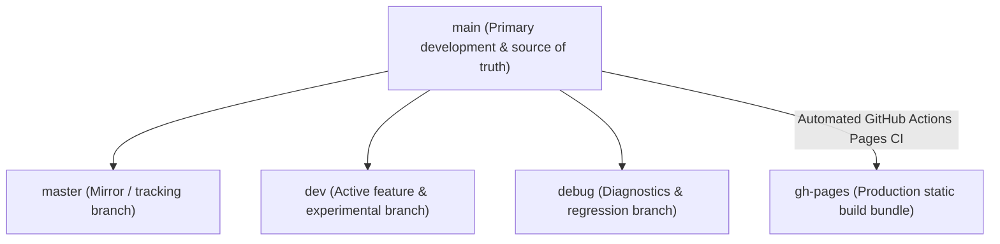

# Deployment & Branch Synchronization

This document outlines the multi-branch synchronization topology, production asset building, and deployment process for **Brain Beats**.

---

## 1. Branch Topology & Tracking Structure

The Brain Beats git repository maintains five active branches across local and remote repositories:



### Branch Roles:
- **`main`**: The primary branch and single source of truth for all code, documentation, and blog posts.
- **`master`**, **`dev`**, **`debug`**: Synchronized branches kept aligned with `main`.
- **`gh-pages`**: Production deployment branch containing pre-rendered Jekyll HTML, static assets, and the service worker bundle.

---

## 2. Multi-Branch Push Workflow

Once changes are tested and committed to `main`, push to all source branches simultaneously:
```bash
git push origin main main:master main:dev main:debug
```

---

## 3. GitHub Pages Deployment (`gh-pages`)

GitHub Pages hosts the live production build from the `gh-pages` branch. The deployment workflow can occur via two mechanisms:

### Automated Cloud Deployment:
When `main` is pushed to `origin`, GitHub Actions executes `.github/workflows/pages.yml`:
1. Checks out repository in a Node 24 environment.
2. Installs Ruby gems and compiles Jekyll with `bundle exec jekyll build`.
3. Runs `npm run build` for CSS, sitemaps, and Workbox Service Worker injection.
4. Commits and deploys the static artifact bundle directly to `gh-pages`.

### Manual / Local Worktree Deployment (Fallback):
If manual synchronization of `gh-pages` is required:
```bash
# 1. Compile production bundle
npm run build
bundle exec jekyll build

# 2. Check out gh-pages into an isolated worktree
git worktree add /tmp/gh-pages-deploy origin/gh-pages

# 3. Synchronize Jekyll output to worktree
rsync -av --delete --exclude '.git' _site/ /tmp/gh-pages-deploy/
touch /tmp/gh-pages-deploy/.nojekyll

# 4. Commit and push
cd /tmp/gh-pages-deploy
git add -A
git commit -m "deploy(pages): sync latest production build"
git push origin HEAD:gh-pages

# 5. Clean up worktree
cd /var/www/brain-beats
git worktree remove /tmp/gh-pages-deploy --force
```

---

## 4. Netlify Edge CDN Deployment

The live domain `https://brain-beats.in` is routed through Netlify Edge CDN with automatic HTTPS.
- **`netlify.toml` Configuration**:
  - Configured with `NODE_VERSION = '24'`.
  - Excludes unstable plugins (e.g. `@netlify/plugin-sitemap`) to guarantee zero-exit-code reliability.
  - Implements static caching headers for audio processors, icons, and precached scripts.
