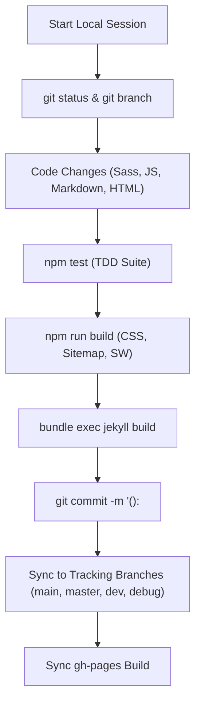

# Development Workflow & Environment

This document defines the local development workflow, environment prerequisites, and daily operational practices for **Brain Beats**.

---

## 1. Overview & Operational Model

Brain Beats is structured to be deployed and tested directly on an in-house server. Because local access avoids external telecommunication and WAN latency, development cycles, test execution, and static page builds execute rapidly.

### Key Environment Characteristics:
- **Offline-Capable Local Hosting**: Runs directly on local web servers or Jekyll development servers.
- **Fast Local Feedback Loop**: Instant test execution (`npm test` in <1 second) and sub-minute static compilation.
- **Self-Contained Dependencies**: No remote runtime API requirements; all synthesis runs client-side.

---

## 2. Environment Prerequisites & Toolchains

| Toolchain | Recommended Version | Primary Role |
| :--- | :--- | :--- |
| **Node.js** | `>= 24.0.0` (as defined in `.nvmrc` and `.node-version`) | Audio engine TDD suite, SCSS compiler, sitemap generator, and Workbox PWA manifest injection |
| **npm** | `>= 10.0.0` | Node package manager and build lifecycle scripts |
| **Ruby** | `3.3.x` | Jekyll blog engine static compilation |
| **Bundler** | `>= 2.3.0` | Ruby gem dependency manager |
| **Git** | `>= 2.30.0` | Version control and branch management |

### Verifying Toolchains:
```bash
node -v      # Should output v24.x or compatible
ruby -v      # Should output ruby 3.3.x
bundle -v    # Should output bundler 2.x
git --version
```

---

## 3. Daily Development Workflow



### Step 1: Branch Verification & Work Ingestion
Always verify that your working tree is clean before beginning new tasks:
```bash
git status
git branch -a
```

### Step 2: Code Changes & Enhancements
- **UI & Layout Styling**: Modify files in `_sass/` (`_base.scss`, `_components.scss`, `_layout.scss`, `_variables.scss`).
  - Do **not** manually edit `css/main.css` or `blog/css/main.css` directly—always edit the source SCSS and compile with `npm run build:css`.
- **Audio Synthesizer Engine**: Edit [`js/main.js`](file:///var/www/brain-beats/js/main.js).
- **Blog Archive Articles**: Create or elaborate posts in `_posts/YYYY-MM-DD-*.md`.
- **Core Web Application Pages**: Edit HTML pages at the repository root (`index.html`, `pure-tones.html`, etc.).

### Step 3: Run the Test Suite (TDD)
Before staging or committing any code, run the audio engine test suite:
```bash
npm test
```
The test suite validates:
- Syntax parsing of `js/main.js`.
- AudioContext initialization and gesture resume listeners.
- Pure tone, binaural, monaural, 3D, and colored noise synthesis logic.
- Volume dynamic gain formulas and bounds.
- Preset JSON databases schema validity across all 25 files.
- Service worker precache physical file integrity (209 URLs).

### Step 4: Recompile Production Assets
Whenever stylesheets, preset lists, or root pages change:
```bash
npm run build
```
This triggers:
1. `npm run build:css`: Transpiles `_sass/` into both `css/main.css` and `blog/css/main.css`.
2. `npm run build:sitemap`: Re-indexes all 1,400+ HTML and blog post URLs into `sitemap.xml`.
3. `npm run build:sw`: Generates `sw-generated.js` via Workbox precache manifest injection.

### Step 5: Test Jekyll Static Compilation
Verify that Jekyll builds cleanly with zero errors:
```bash
export PATH="$HOME/.local/share/gem/ruby/3.3.0/bin:$PATH"
export GEM_HOME="$HOME/.local/share/gem/ruby/3.3.0"
bundle exec jekyll build
```

---

## 4. Commit Conventions

Brain Beats follows standard Conventional Commits formatting:
- `feat(blog): elaborate August 2024 batch posts (709 Hz - 719 Hz)`
- `fix(ux): enhance visual playback feedback, navbar spacing, and search affordance`
- `refactor(audio): optimize volume gain dynamics algorithm`
- `deploy(pages): update production web application build for gh-pages`

---

## 5. Directory Preservation Rules

> [!IMPORTANT]
> The directory `/var/www/brain-beats/lab` contains historical research scripts and frequency databases (55 total files).
> - Never delete or rename `/lab`.
> - Never run automated clean scripts that purge `/lab`.
> - Keep `/lab` tracked and preserved across all branches.
