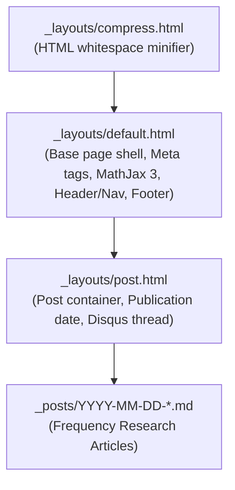

# Jekyll Blog & Content Publishing

This document describes the Liquid templating architecture, layout inheritance, and research post authoring standards for the **Brain Beats** blog.

---

## 1. Jekyll & Liquid Architecture Overview

The blog platform is built with Jekyll 4.4 and runs alongside the main PWA application. It indexes over 1,400 scientific articles and frequency research entries.



---

## 2. Layout Structure & DRY Metadata Inheritance

### `_layouts/default.html`
Provides standard SEO, OpenGraph, and Twitter card fallback resolution:
- **Title**: `page.title | default: site.name`
- **Description**: `page.description | default: site.description | default: page.title`
- **Canonical URLs**: `{{ site.url }}{{ page.url | remove: 'index.html' }}`
- **MathJax 3 CDN & Local Fallback**: Integrated via ``.
- **Analytics & Feeds**: Integrated via `analytics.html` and Atom feed autodiscovery.

### `_layouts/post.html`
Wraps individual frequency articles:
- Renders W3C compliant `<time datetime="{{ page.date | date_to_xmlschema }}">{{ page.date | date: "%B %d, %Y" }}</time>`.
- Embeds canonical Disqus comment thread with dynamic page URL configuration (``).

---

## 3. Standard Frequency Research Post Structure

Every frequency post in `_posts/` adheres to a strict four-part documentation framework:

### Part 1: Biophysical & Clinical Scope
- Precise identification of target organisms or conditions from the Consolidated Annotated Frequency List (CAFL).
- Exact musical pitch mapping ($A_4 = 440\text{ Hz}$) with semitone offset in cents.
- Cellular and mechanical resonance hypotheses (membrane permeability, enzyme disruption, bio-field entrainment).

### Part 2: Acoustic Harmonic Structure & ASCII Diagram
Visual representation of fundamental frequency $f_0$, octave sub-harmonics, and overtones:
```
+-------------------------------------------------------------------------+
|                  719 Hz ACOUSTIC HARMONIC STRUCTURE                    |
+-------------------------------------------------------------------------+
|  Sub-octaves:     179.75 <---> 359.50                                   |
|  Fundamental:     719.00 Hz  (F5 (+50.3 cents))                         |
|  Overtones:       1438.00 <---> 2157.00 <---> 2876.00                   |
+-------------------------------------------------------------------------+
```

### Part 3: Mathematical Formulations with MathJax
LaTeX equations documenting:
1. Sub-harmonic series: $f_n = f_0 \times 2^{-n}$
2. Upper harmonics: $f_n = f_0 \times n$
3. Interval ratios relative to concert pitch: $\frac{f_0}{440}$

### Part 4: Standalone Web Audio API Synthesizer Class
Every post includes an executable JavaScript class demonstrating how to synthesize that exact frequency in the browser with anti-click gain ramp envelopes:
```javascript
class PrecisionToneSynthesizer {
    constructor(frequency = 719.0) {
        this.frequency = frequency;
        this.audioCtx = null;
        this.oscillator = null;
        this.gainNode = null;
    }
    // initialize(), start(), stop() implementations
}
```

---

## 4. Feed & Sitemap Generation

1. **Atom & RSS Feeds**:
   - `blog/blog/atom.xml`: Generates a W3C-valid XML feed capped to the 50 most recent posts with escaped titles and XML character sanitization.
   - `feed.xml`: Site-wide RSS feed.
2. **Sitemap**:
   - `scripts/generate-sitemap.js`: Scans the entire project tree and produces a clean 1,415+ URL sitemap (`sitemap.xml`) referencing `https://brain-beats.in`.
